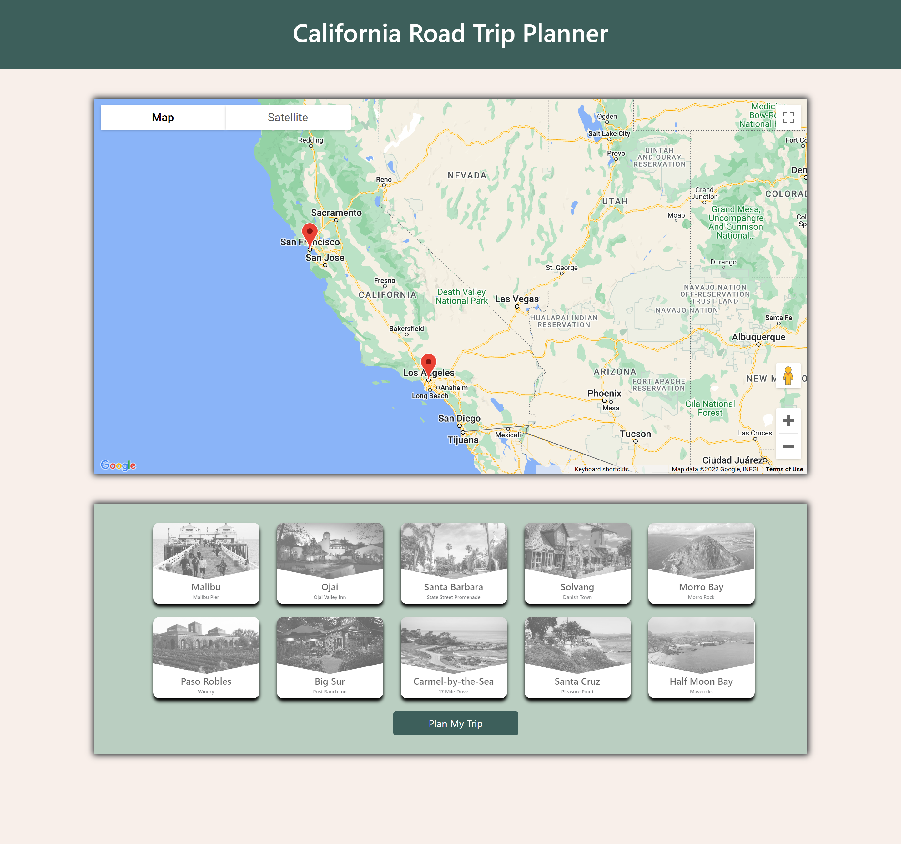
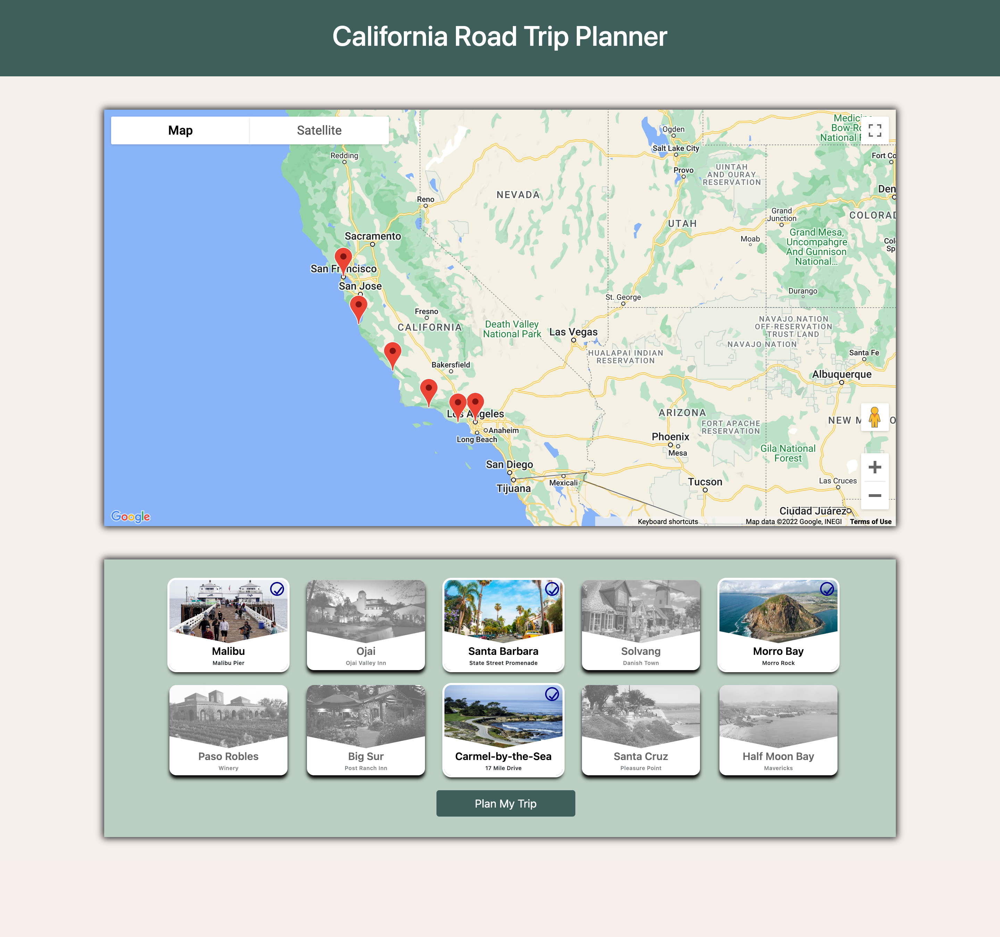
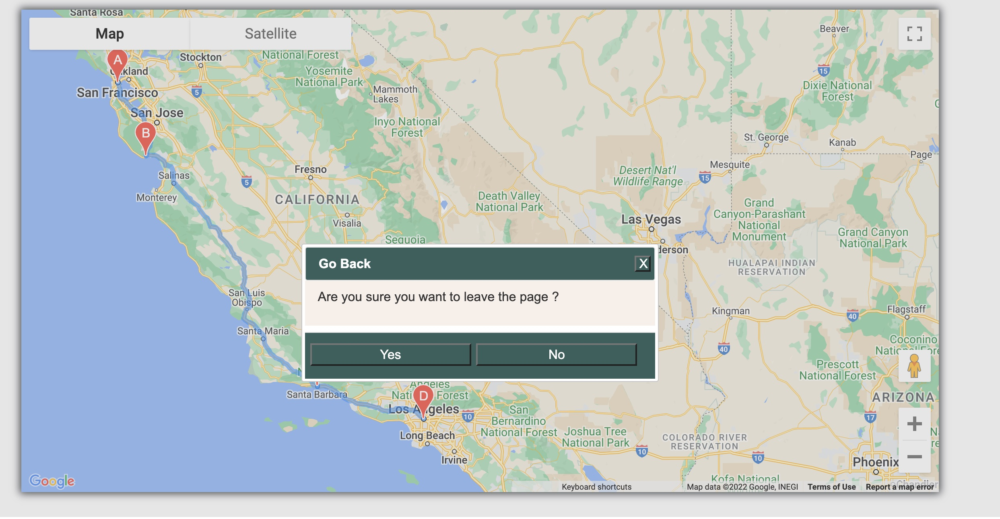
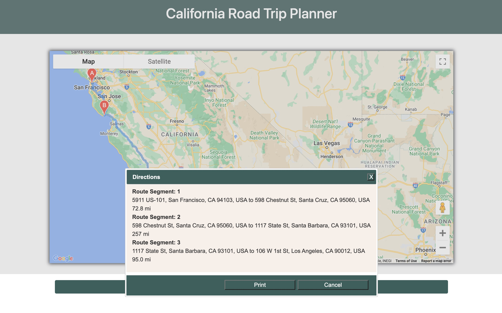

# CALIFORNIA ROAD TRIP PLANNER

## Project Description

 California Road Trip Planner is a web Application created using HTML5,CSS3 and implemented its functionality
 using JS and JQ Libraries and styled using Bootstrap and JQUery UI Widgets.Application provides a route map with start and destination marker and checklist of attractions for user to select.Once the user choose attraction using Google Direction Service,application creates a route and generate directions.Also provide user with the nearest dining options and display the restaurant name,address and image and a placeholder carousel for nearest Best Western Hotels.

### User Story

As a California visitor, I want to take a scenic multi-day road trip from Los Angeles to San Francisco along California’s scenic Pacific Coast Highway.  I want to be given information about the top destinations along the route and be presented with the recommended dining options and the nearest Best Western accommodation at each destination.

### Acceptance Criteria

* GIVEN I am accessing a California road trip planner from Los Angeles to San Francisco
* WHEN I access the application
* THEN I am given a map of California followed by a list of attractions between Los Angeles and San Francisco
* WHEN I select the desired attractions and click on "Plan My Trip"
* THEN I am presented with four items: (1) a new map of California that highlights the suggested route; (2) A carousel displaying each stop and recommended hotel; (3) A button giving me an option to "Get Directions," and (4) A button giving me an option to save the map and suggested route to Local Storage.

### Links

*  Github Repo : https://github.com/aaloksikand/California_Road_Trip_Planner/

*  Live Link : https://aaloksikand.github.io/California_Road_Trip_Planner/

### Technologies/Frameworks/Libraries Used

* HTML5
* CSS3
* JAVASCRIPT
* JQUERY
* JQUERY UI WIDGETS
* BOOTSTRAP FRAMEWORK

### APIs Used

* GOOGLE's MAPS JAVASCRIPT API
* DIRECTION SERVICE of DIRECTION API
* YELP API

### Screenshot

Below is the start page of the Application

Below Page is  when user have selected the checkboxes

Below Page is  Route is created based on attractions selected

Below Dialog Box for Go Back Button

Below is Dialog Box for Directions Button

### References

* MAPS JAVASCRIPT API -  https://developers.google.com/maps/documentation/javascript/overview
* DIRECTIONS SERVICES - https://developers.google.com/maps/documentation/javascript/directions
* YELP API - https://www.yelp.com/developers/documentation/v3/business_search
* BOOTSTRAP CAROUSEL- https://getbootstrap.com/docs/4.0/components/carousel/
* CORS ERROR FIX - https://dev.to/sandeepkumardev/fix-the-cors-and-how-the-access-control-allow-origin-header-works-17el#:~:text=Access-Control-Allow-Origin%3A%20%2A%20Once%20the%20browser%20receives%20this%20header,the%20API%20request%20with%20the%20CORS%20policy%20error.
* JQUERY UI DIALOG BOX - https://jqueryui.com/dialog/#modal-confirmation
